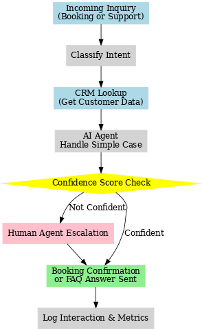
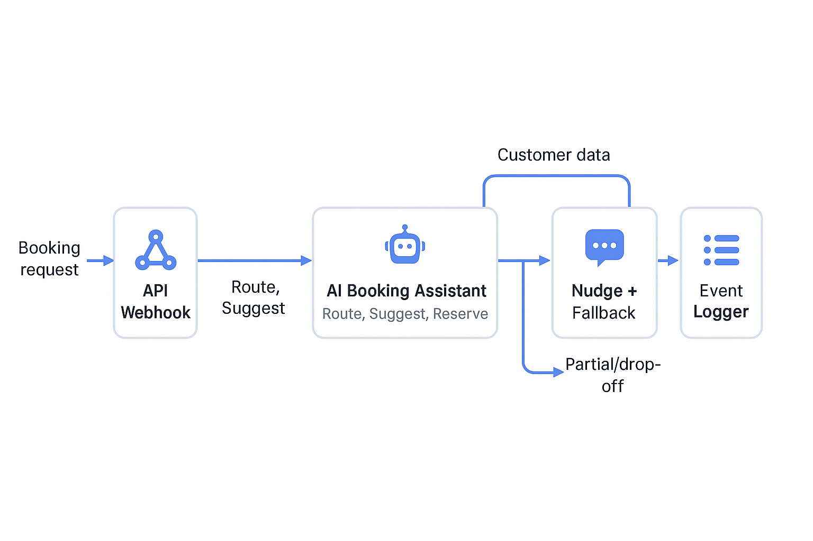

# AI Booking Optimization and Smart Agent Escalation System

> **Project Pitch:**  
> I built an AI-driven system that optimizes online booking flows and customer support for travel transfers.  
> The system intelligently guides users through the booking process, auto-answers frequent questions, and escalates complex cases to human agents — using real-time confidence scoring and CRM integration to maximize speed and satisfaction.

---

## System Diagram

---

## What It Does
- Receives incoming booking inquiries or support questions
- Classifies intent and routes simple cases to the AI agent
- AI agent answers FAQs, booking edits, cancellations, and transfer confirmations
- If confidence is low or user is unsatisfied, the system escalates to a human agent
- Connects directly to the CRM and booking platform to pull or update real-time customer data
- Uses A/B testing to continuously optimize AI messaging and flow efficiency

---
## 📊 Booking Optimization Flow Diagram

This system uses AI to route customers through the booking process with CRM integration, fallback nudges, and event logging:

## Technologies Used
- OpenAI (chat completion and classification)
- n8n (workflow orchestration)
- CRM API Integration (HubSpot, Zoho, or similar)
- Booking system API connection
- LangChain prompt routing (for escalation decision making)
- Confidence score-based escalation triggers
- A/B Testing layer for conversational experiments

---

## Files
- **ai_booking_optimization_workflow.json** — Exported n8n workflow
- **ai-booking-optimization-system-diagram.png** — Visual diagram of system logic

---

## KPIs Measured
- Booking completion rate
- AI self-resolution rate
- Escalation to human (%)
- Customer satisfaction score (CSAT)
- Booking flow average time

---

## Why This Matters
This system shows how a carefully designed AI agent can enhance customer experience without replacing humans — speeding up bookings, deflecting unnecessary support cases, and increasing customer loyalty.  
It proves real-world AI deployment with measurable business value, aligned with Alps2Alps goals.

---

## Future Work

- Add multilingual support for AI booking conversations
- Introduce dynamic confidence threshold adjustment based on live user feedback
- Expand CRM integration to include loyalty program status and upsell recommendations
- Build a predictive booking delay detection agent using live traffic and weather data

---
*Demo built for AI Agent Implementation Manager portfolio presentation.*
