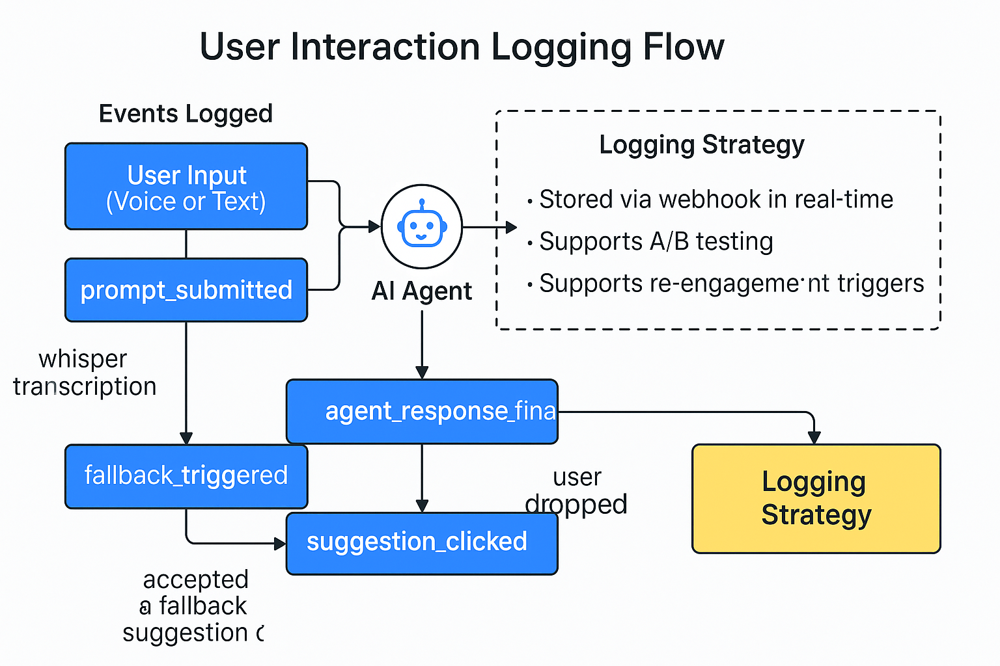

# 📊 Data Logging Events

This document outlines key user actions logged during the booking/prompt refinement flow to support analytics, AI training, and fallback decision-making.

---

## 🧠 Events Logged

| Event Name             | Description                                           |
|------------------------|-------------------------------------------------------|
| prompt_submitted       | Raw input (voice or text) captured for processing    |
| whisper_transcription  | Voice input converted to text using Whisper API      |
| agent_response_started | When AI agent begins response generation             |
| agent_response_final   | Final prompt or answer generated                     |
| fallback_triggered     | Primary agent failed; fallback logic activated       |
| user_dropped           | User exited before completion                        |
| suggestion_clicked     | User accepted a fallback suggestion or nudge         |

---

## 🗃️ Logging Strategy

- Stored via webhook in real-time to CRM or log database
- Supports tracking prompt quality, completion rates, and re-engagement triggers
- Enables A/B testing across prompt types or flow orders

---

## 🖼️ Visual Logging Flow

*A flowchart of how user inputs and AI responses are logged in real-time for analytics and optimization.*

_Last updated: May 2025_ 
